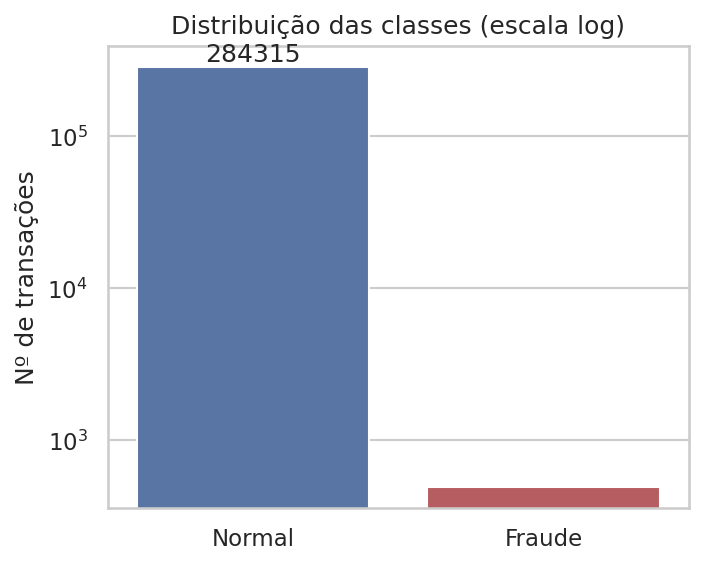
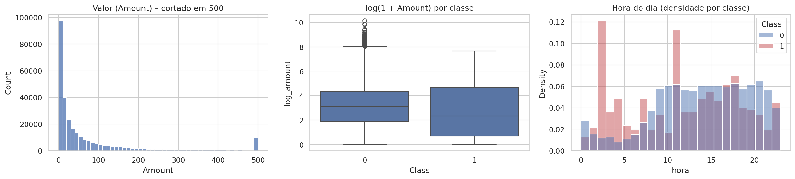
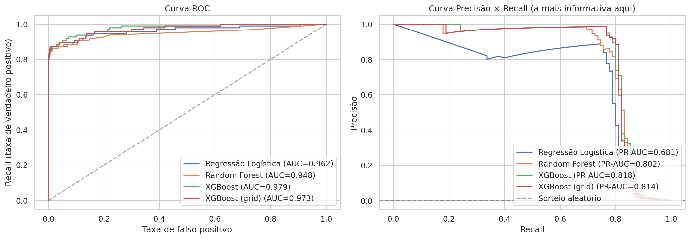
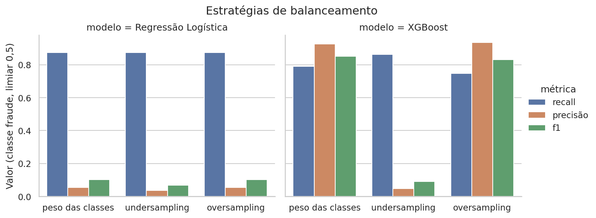
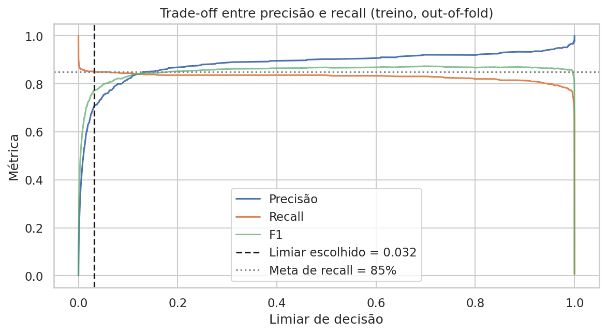
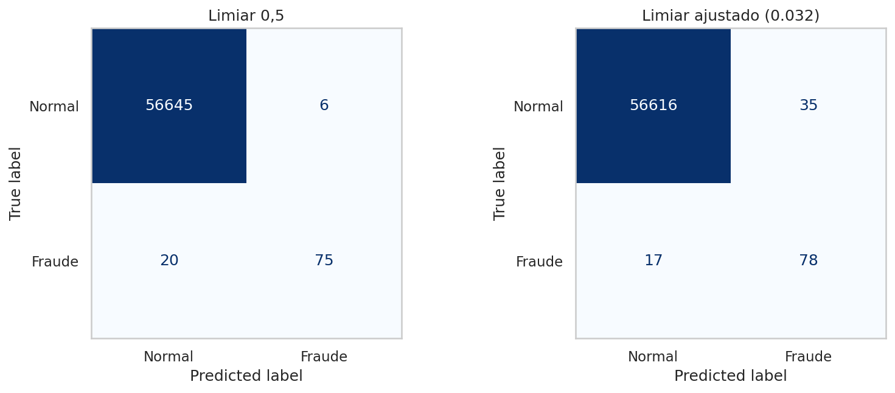
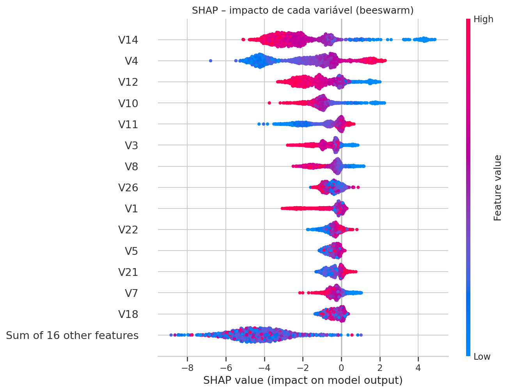
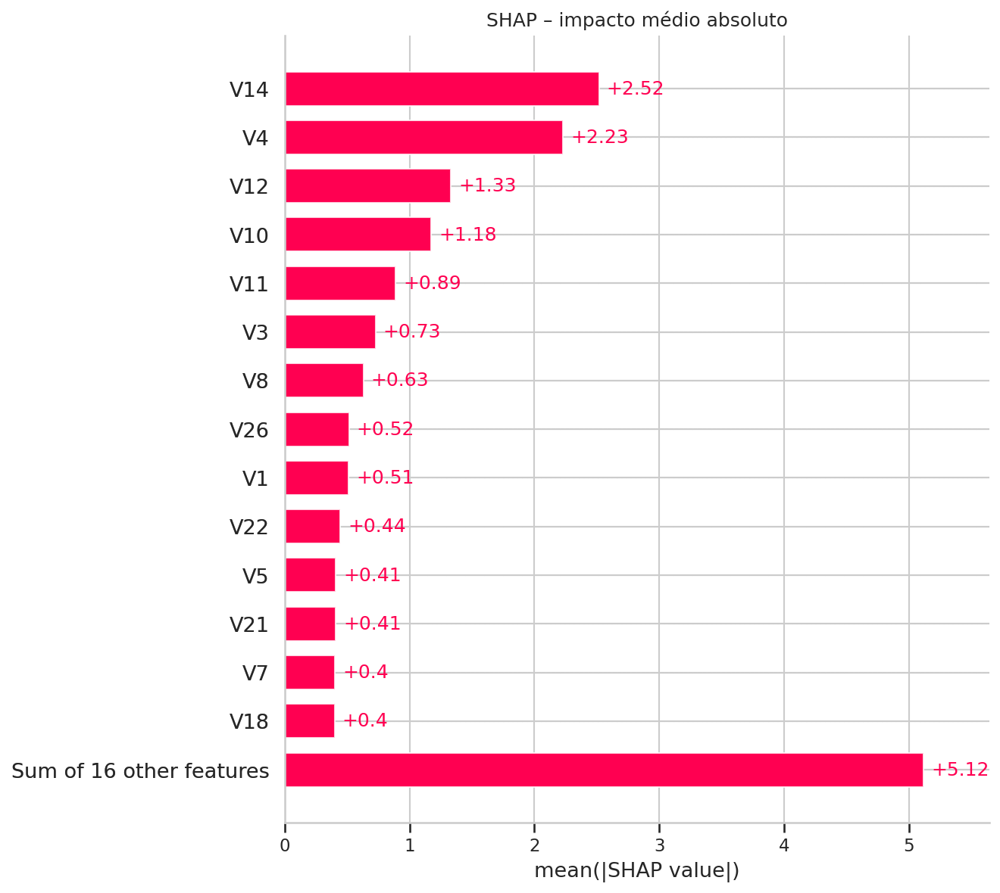
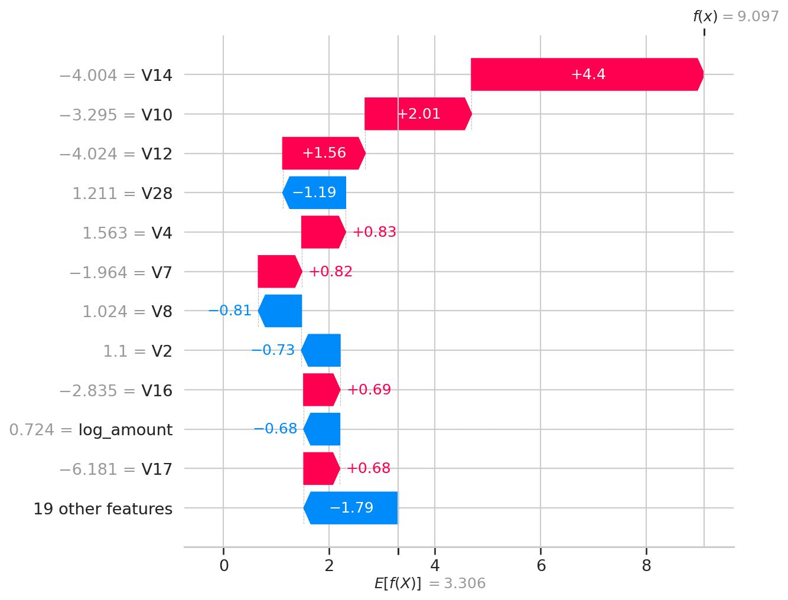
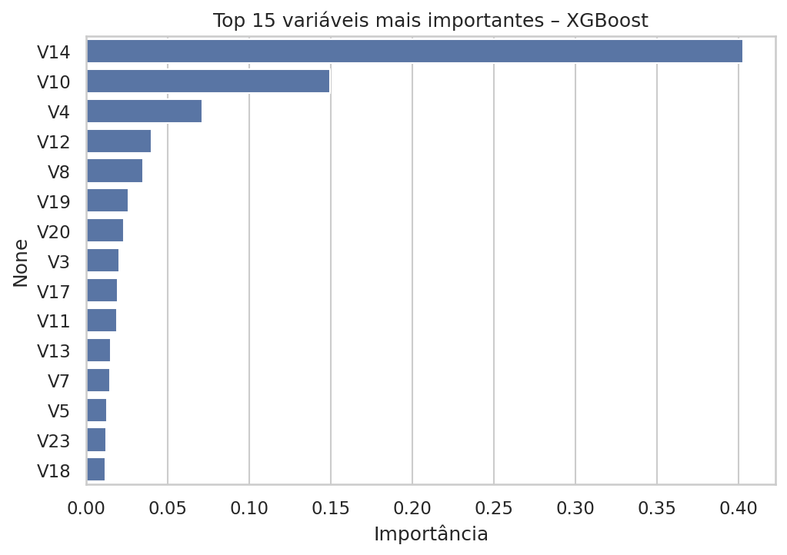

# 🕵️ Detecção de Fraudes em Transações de Cartão de Crédito

Projeto de Machine Learning para detectar fraudes em transações reais de cartão de crédito,
um problema em que a fraude é rara e a **acurácia engana**.

[](https://colab.research.google.com/github/Jgmc2025/deteccao-fraude-cartao-credito/blob/main/deteccao_fraude_cartao.ipynb)

## 📁 Conteúdo do repositório

| Arquivo | Descrição |
|---|---|
| `deteccao_fraude_cartao.ipynb` | Notebook completo (exploração → explicação do modelo) |
| `imagens/` | Gráficos gerados pelo notebook (10 figuras) |
| `resultados/` | Tabelas de métricas em CSV |
| `requirements.txt` | Bibliotecas usadas |
| `README.md` | Este documento |

O dataset **não** fica no repositório: o notebook o carrega pelo link (`DATA_URL`).

## 1. O problema e por que o desbalanceamento muda a avaliação

A base tem colunas `Time`, `Amount`, `Class` e `V1`–`V28` (variáveis anonimizadas por PCA).
São 284.807 transações, das quais só **492 (0,17%)** são fraude.



Um modelo que responde "não é fraude" para tudo tem ~99,8% de acurácia e **recall de 0%**:
não pega nenhuma fraude. Por isso a avaliação usa, para a classe de fraude:

- **Recall** – das fraudes reais, quantas o modelo detectou (métrica principal);
- **Precisão** – dos alertas emitidos, quantos eram fraude de verdade;
- **F1** – equilíbrio entre as duas;
- **PR-AUC** (curva precisão × recall) – para comparar modelos, mais informativa que a ROC quando a classe é rara.

## 2. Preparação dos dados

- Remoção de linhas duplicadas.
- Novas variáveis: `log_amount` (log(1 + valor)) e `hora` (hora do dia derivada de `Time`).
- Separação treino/teste (80/20) com `stratify`, mantendo ~0,17% de fraude nos dois.
- `StandardScaler` **ajustado apenas no treino** (evita vazamento de dados).



Observações da exploração: as fraudes têm valor mediano menor que as transações normais e se concentram em alguns horários (picos por volta de 2h e 11h). Atenção: `hora` é calculada a partir de `Time` (segundos desde a primeira transação da base), então não é necessariamente o horário real do relógio.

## 3. Comparação entre os modelos (classe de fraude, conjunto de teste)

Todos usam peso de classes. Métricas com limiar 0,5, exceto a última linha. O teste tem 95 fraudes.

| Modelo | Recall | Precisão | F1 | ROC-AUC | PR-AUC |
|---|---|---|---|---|---|
| Regressão Logística (baseline) | 0,8737 | 0,0547 | 0,1030 | 0,9623 | 0,6810 |
| Random Forest | 0,7368 | 0,9333 | 0,8235 | 0,9483 | 0,8018 |
| **XGBoost** | 0,7895 | 0,9259 | **0,8523** | **0,9789** | **0,8175** |
| XGBoost (GridSearchCV) | 0,7895 | 0,9146 | 0,8475 | 0,9730 | 0,8142 |
| XGBoost com limiar ajustado (0,032) | 0,8211 | 0,6903 | 0,7500 | 0,9789 | 0,8175 |



**Leitura:**

- A **Regressão Logística** tem o recall mais alto no limiar 0,5, mas com precisão de apenas ~5%: para cada fraude
  correta, gera muitos alertas falsos. Por isso o F1 é muito baixo (0,10).
- **XGBoost** e **Random Forest** têm o melhor equilíbrio. O XGBoost lidera em F1, ROC-AUC e PR-AUC e foi o modelo final.
- O `GridSearchCV` (busca pequena) não superou o XGBoost inicial no teste; a diferença é pequena.
- Curva ROC parece ótima para todos (~0,95–0,98), mas a curva de precisão × recall mostra a diferença real entre eles.

### Undersampling × oversampling × peso de classes

| Estratégia | Modelo | Recall | Precisão | F1 | PR-AUC |
|---|---|---|---|---|---|
| Peso das classes | Regressão Logística | 0,8737 | 0,0547 | 0,1030 | 0,6810 |
| Peso das classes | XGBoost | 0,7895 | 0,9259 | 0,8523 | 0,8175 |
| Undersampling | Regressão Logística | 0,8737 | 0,0359 | 0,0689 | 0,4719 |
| Undersampling | XGBoost | 0,8632 | 0,0478 | 0,0906 | 0,7034 |
| Oversampling | Regressão Logística | 0,8737 | 0,0549 | 0,1032 | 0,6809 |
| Oversampling | XGBoost | 0,7474 | 0,9342 | 0,8304 | 0,8110 |



O **undersampling** elevou o recall do XGBoost (0,79 → 0,86), mas derrubou a precisão para ~5% (F1 de 0,85 para 0,09):
o modelo passa a marcar como fraude muita transação legítima. O **oversampling** quase não mudou os resultados em
relação ao peso de classes. Neste projeto, o **peso de classes** deu o melhor equilíbrio.

## 4. Limiar de decisão e SHAP

### Limiar

- **Limiar escolhido: 0,032.** Definido por validação cruzada (previsões out-of-fold) no treino, com a regra
  *"maior precisão entre os limiares com recall ≥ 85%"*. O teste **não** foi usado para escolher o limiar.
- No teste, comparando com o limiar padrão:

| Limiar | Fraudes detectadas | Fraudes perdidas | Alertas falsos | Recall | Precisão | F1 |
|---|---|---|---|---|---|---|
| 0,5 (padrão) | 75 de 95 | 20 | 6 | 0,789 | 0,926 | 0,852 |
| 0,032 (ajustado) | 78 de 95 | 17 | 35 | 0,821 | 0,690 | 0,750 |




**Interpretação honesta:** baixar o limiar detectou **3 fraudes a mais**, ao custo de **29 alertas falsos a mais**, e o F1
caiu. Se perder uma fraude custa muito mais do que investigar um alerta falso, o limiar ajustado pode compensar;
caso contrário, o limiar 0,5 é o melhor equilíbrio. Além disso, o recall de ~85% visto na validação cruzada
(treino) foi de ~82% no teste, o que é esperado com tão poucas fraudes (95) e mostra que a estimativa tem incerteza.

### O que o SHAP mostrou






- As variáveis que mais pesam são **V14, V4, V12 e V10**, seguidas de V11, V3 e V8. A importância nativa do XGBoost
  também coloca V14 e V10 no topo.
- **Direção do impacto:** valores **baixos** de V14, V12 e V10 empurram a previsão para fraude, enquanto valores
  **altos** de V4 e V11 também aumentam a chance de fraude.
- No exemplo do *waterfall* (uma fraude detectada), V14 (−4,0), V10 (−3,3) e V12 (−4,0) somam a maior parte da evidência
  para fraude; os valores estão padronizados (desvios-padrão).
- `log_amount` teve impacto pequeno nesse exemplo. Como `V1`–`V28` vêm de PCA, não têm significado de negócio direto:
  o SHAP mostra quais componentes separam melhor fraude de transação normal, mas não o "motivo" em termos de negócio.

## 5. O que eu mudei / decidi diferente

Adapte esta lista ao que você realmente fez e ao que a Expert mostrou nas aulas:

- Padronização **depois** da separação treino/teste (scaler ajustado só no treino).
- Remoção de duplicatas antes da divisão.
- Limiar escolhido por **validação cruzada no treino**, sem olhar o teste.
- Uso do **PR-AUC** (`average_precision`) como métrica do `GridSearchCV`.
- Undersampling e oversampling implementados só com NumPy/pandas e aplicados apenas ao treino.
- Explicação de uma fraude individual com SHAP *waterfall*, além dos gráficos globais.

## ▶️ Como executar

1. Clique no botão **Abrir no Colab** (ou envie o `.ipynb` para o Google Colab).
2. Execute **Ambiente de execução → Executar tudo**.
3. Para rodar mais rápido, defina `EXECUTAR_GRID = False` na célula de configuração.

Localmente:

```bash
pip install -r requirements.txt
jupyter notebook deteccao_fraude_cartao.ipynb
```

## 🛠️ Tecnologias

Python · pandas · NumPy · scikit-learn · XGBoost · SHAP · Matplotlib · Seaborn

## ⚠️ Limitações

- O split é aleatório (sem validação temporal); em produção, valide por período.
- O modelo final é escolhido pelo PR-AUC no teste; o ideal seria um conjunto de validação separado.
